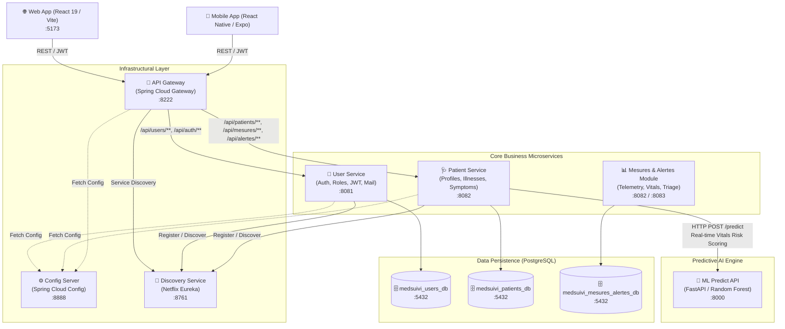

# 🏥 MediSuivi — Backend Microservices Architecture

[](https://adoptium.net/)
[](https://spring.io/projects/spring-boot)
[](https://spring.io/projects/spring-cloud)
[](https://www.postgresql.org/)
[](https://www.docker.com/)
[](https://www.jenkins.io/)
[](https://www.sonarqube.org/)

> **MediSuivi** is a connected patient telemonitoring and clinical decision-support platform designed for proactive management of chronic illnesses (*Diabetes, Hypertension, Asthma, Heart Failure*).
>
> This repository hosts the distributed backend microservices powering authentication, patient records, vital signs telemetry, alert triaging, centralized configuration, routing, and machine learning risk evaluation.

---

## 📑 Table of Contents

- [Architectural Overview](#-architectural-overview)
- [Microservices Catalog](#-microservices-catalog)
- [Key Features by Domain](#-key-features-by-domain)
  - [1. User & Identity Management](#1-user--identity-management-user-service)
  - [2. Patient & Clinical Management](#2-patient--clinical-management-patient-service)
  - [3. Mesures & Alertes (Telemetry & Triage)](#3-mesures--alertes-telemetry--triage)
  - [4. AI Risk Assessment & Fallback Engine](#4-ai-risk-assessment--fallback-engine)
- [API Gateway Routing Table](#-api-gateway-routing-table)
- [REST API Reference](#-rest-api-reference)
- [Technology Stack](#-technology-stack)
- [Prerequisites](#-prerequisites)
- [Getting Started & Local Setup](#-getting-started--local-setup)
  - [Database Initialization](#1-database-initialization)
  - [Build the Aggregator](#2-build-all-services-maven-aggregator)
  - [Service Startup Sequence](#3-service-startup-sequence)
- [Containerization with Docker](#-containerization-with-docker)
  - [Single Unified Dockerfile](#single-unified-dockerfile)
  - [Docker Compose Quickstart](#docker-compose-quickstart)
- [CI/CD & DevOps Pipeline](#-cicd--devops-pipeline)
- [Testing & Quality Assurance](#-testing--quality-assurance)
- [MediSuivi Platform Ecosystem](#-medisuivi-platform-ecosystem)

---

## 🏛 Architectural Overview

MediSuivi leverages a cloud-native, decentralized microservices architecture built on **Spring Cloud** and containerized for high availability, fault tolerance, and loose coupling.



---

## 📦 Microservices Catalog

| Service | Technology | Port | DB / Dependency | Responsibility |
| :--- | :--- | :--- | :--- | :--- |
| **`config-server`** | Spring Cloud Config | `8888` | Native (`classpath:/configurations`) | Centralized external configuration repository for all environments. |
| **`discovery`** | Spring Cloud Netflix Eureka | `8761` | In-Memory Registry | Dynamic service registration, heartbeat monitoring, and client discovery. |
| **`gateway`** | Spring Cloud Gateway | `8222` | Eureka Locator | Single-entry reverse proxy, route rewriting, global CORS handling, and load-balancing (`lb://`). |
| **`user-service`** | Spring Boot 3.2.2, JJWT, Spring Mail | `8081` | PostgreSQL (`medsuivi_users_db`) | Authentication, account creation, role-based access control (RBAC), password reset workflow. |
| **`patient-service`** | Spring Boot 3.2.2, Data JPA | `8082` | PostgreSQL (`medsuivi_patients_db`) | Patient files, doctor assignment, chronic condition tracking, symptom reports. |
| **`mesures-alertes`** | Integrated in `patient-service` *(Config-ready standalone on `8083`)* | `8082` / `8083` | PostgreSQL (`medsuivi_mesures_alertes_db`) | Vital sign telemetry ingestion, real-time threshold scoring, alert generation and medical triage. |
| **`predict-api`** | Python 3.10+, FastAPI, Scikit-Learn | `8000` | Random Forest model | Predictive risk scoring based on patient telemetry deviations and 14-day trends. |

---

## 💡 Key Features by Domain

### 1. User & Identity Management (`user-service`)
- **JWT Authentication & Security**: Stateless authentication using secure JJWT (`HMAC-SHA256`).
- **Role-Based Access Control (RBAC)**: Support for three distinct personas:
  - `PATIENT`: Consults personal medical telemetry, symptoms, and alerts.
  - `MEDECIN`: Supervises assigned patients, examines critical metrics, and resolves alerts.
  - `ADMIN`: Platform administration and user accounts management.
- **Account Recovery**: Automated email dispatch with time-sensitive verification tokens via SMTP (Mailtrap / Production SMTP).

### 2. Patient & Clinical Management (`patient-service`)
- **Medical Dossier**: Demographics, date of birth, biological sex, contact info, and medical doctor assignment (`medecinId`).
- **Chronic Diseases (`Maladie`)**: Registry of managed chronic diseases with normal physiological thresholds (`seuilMin`, `seuilMax`).
- **Pathology Mapping (`PatientMaladie`)**: Tracks diagnostic date, treatment protocols, and notes for each disease assigned to a patient.
- **Symptom Logbook (`Symptome`)**: Allows patients to report active symptoms with descriptions and timestamps.

### 3. Mesures & Alertes (Telemetry & Triage)
- **Supported Biomarkers**:
  - `GLYCEMIE` (mg/dL) — Diabetes
  - `TENSION` (mmHg) — Hypertension
  - `SPO2` (%) — Asthma / Respiratory failure
  - `FREQUENCE_CARDIAQUE` (bpm) — Cardiac insufficiency
  - `TEMPERATURE` (°C)
  - `POIDS` (kg)
- **Data Ingestion Sources**: Manual user input (`MANUELLE`) or connected IoT health sensors (`CAPTEUR`).
- **Intelligent Clinical Triaging**: Automatic evaluation of alert severity:
  - `FAIBLE` 🟢 — Normal / Mild variance
  - `MODERE` 🟡 — Out of baseline range, monitoring suggested
  - `ELEVE` 🟠 — Serious deviation, medical check recommended
  - `CRITIQUE` 🔴 — Emergency thresholds breached
- **Alert Lifecycle**: Status toggle (`traitee: false` $\rightarrow$ `true`) by treating medical professionals once acknowledged.

### 4. AI Risk Assessment & Fallback Engine
When new vital measurements are recorded, `patient-service` automatically dispatches the patient's updated clinical profile to the ML service (`http://localhost:8000/predict`):
- **Features Analyzed**: Age, sex, primary disease, days since diagnosis, measurement deviation score, 14-day rolling mean, 14-day rolling standard deviation, 14-day trend slope, and 7-day symptom count.
- **Resilient Clinical Fallback**: If the ML microservice is unreachable, `patient-service` activates a built-in clinical heuristic rule engine ensuring zero interruption to patient risk classification.

---

## 🔀 API Gateway Routing Table

All external client traffic connects through `http://localhost:8222/api/**`. The Gateway dynamically strips the `/api` prefix and routes to the appropriate microservice registered in Eureka:

| Incoming Gateway Route | Target Microservice | Forwarded Route | Description |
| :--- | :--- | :--- | :--- |
| `POST /api/auth/**` | `lb://user-service` | `/auth/**` | Registration, login, password recovery |
| `GET/POST/PUT/DELETE /api/users/**` | `lb://user-service` | `/users/**` | User management |
| `GET/POST/PUT/PATCH/DELETE /api/patients/**` | `lb://patient-service` | `/patients/**` | Patient records & risk scoring |
| `GET/POST/PUT/DELETE /api/medecins/**` | `lb://patient-service` | `/medecins/**` | Doctor management & assigned patients |
| `GET/POST/PUT/DELETE /api/maladies/**` | `lb://patient-service` | `/maladies/**` | Disease catalog |
| `GET/POST/DELETE /api/patient-maladies/**` | `lb://patient-service` | `/patient-maladies/**` | Patient-to-disease association |
| `GET/POST/DELETE /api/symptomes/**` | `lb://patient-service` | `/symptomes/**` | Symptom declaration |
| `GET/POST/DELETE /api/mesures/**` | `lb://patient-service` | `/mesures/**` | Vital signs telemetry |
| `GET/POST/PATCH/DELETE /api/alertes/**` | `lb://patient-service` | `/alertes/**` | Alert triage & resolution |

---

## 📡 REST API Reference

### 🔐 Authentication & Users (`user-service`)

```http
POST /api/auth/register
POST /api/auth/login
POST /api/auth/forgot-password
POST /api/auth/reset-password
GET  /api/users
GET  /api/users/{id}
PUT  /api/users/{id}
DELETE /api/users/{id}
```

<details>
<summary>▶ Click to inspect Sample Login Payload & Response</summary>

**Request:**
```json
POST /api/auth/login
Content-Type: application/json

{
  "email": "doctor@medisuivi.tn",
  "motDePasse": "SecurePass123!"
}
```

**Response (`200 OK`):**
```json
{
  "token": "eyJhbGciOiJIUzI1NiJ9...",
  "type": "Bearer",
  "id": 12,
  "email": "doctor@medisuivi.tn",
  "nom": "Ben Salem",
  "prenom": "Mohamed",
  "role": "MEDECIN"
}
```
</details>

---

### 🩺 Patients & Clinical Records (`patient-service`)

```http
POST   /api/patients                  # Create a new patient profile
GET    /api/patients                  # Retrieve all patients
GET    /api/patients/{id}             # Retrieve patient by ID
GET    /api/patients/user/{userId}    # Retrieve patient by linked User ID
GET    /api/patients/medecin/{id}     # Retrieve all patients supervised by a doctor
PUT    /api/patients/{id}             # Update patient details
PATCH  /api/patients/{id}/niveau-risque?niveauRisque=ELEVE # Manual risk level update
DELETE /api/patients/{id}             # Remove patient
POST   /api/patients/{id}/predict-risk # Trigger on-demand ML risk assessment
```

```http
POST   /api/medecins                  # Register a doctor
GET    /api/medecins                  # List doctors
GET    /api/medecins/{id}             # Get doctor by ID
GET    /api/medecins/{id}/patients    # Query assigned patients (filter by ?maladieId & ?niveauRisque)
```

---

### 📊 Mesures & Vital Signs Telemetry

```http
POST   /api/mesures                   # Submit a vital sign measurement (auto-triggers risk evaluation)
GET    /api/mesures/{id}              # Get measurement by ID
GET    /api/mesures/patient/{id}      # Get historical measurements for a patient
GET    /api/mesures/medecin/{id}      # Get measurements for all patients of a doctor
DELETE /api/mesures/{id}              # Delete measurement entry
```

<details>
<summary>▶ Click to inspect Sample Mesure Submission</summary>

**Request:**
```json
POST /api/mesures
Content-Type: application/json

{
  "patientId": 5,
  "typeMesure": "GLYCEMIE",
  "valeur": 185.0,
  "unite": "mg/dL",
  "source": "CAPTEUR"
}
```
</details>

---

### 🚨 Alertes & Clinical Triage

```http
POST   /api/alertes                   # Create alert manually or via telemetry rule
GET    /api/alertes/{id}              # Get alert by ID
GET    /api/alertes/patient/{id}      # List alerts for a specific patient
GET    /api/alertes/medecin/{id}      # List alerts for all patients under a doctor
GET    /api/alertes?traitee=false     # Filter pending (untreated) or treated alerts
PATCH  /api/alertes/{id}/traiter      # Mark alert as resolved (traitee: true)
DELETE /api/alertes/{id}              # Delete alert
```

---

## 🛠 Technology Stack

- **Backend Framework**: Java 17, Spring Boot `3.2.2`, Spring Cloud `2023.0.0`
- **Security**: Spring Security 6, JJWT `0.12.3` (JSON Web Token)
- **Service Discovery & Config**: Netflix Eureka Server, Spring Cloud Config
- **API Gateway**: Spring Cloud Gateway (reactive, Netty-based)
- **Database & Persistence**: PostgreSQL 15+, Spring Data JPA, Hibernate ORM
- **Testing & Quality**: JUnit 5, Mockito, JaCoCo `0.8.11`, SonarQube Scanner
- **DevOps & Containers**: Docker, Docker Compose, Jenkins Multibranch Pipeline
- **Predictive Engine**: Python 3.10+, FastAPI, Scikit-Learn, Joblib

---

## 📋 Prerequisites

Ensure you have the following installed locally:

- **JDK 17** (e.g., Eclipse Temurin 17)
- **Apache Maven 3.9+** (or use the provided `mvnw` wrappers)
- **PostgreSQL 14+** running on `localhost:5432`
- **Docker & Docker Compose** (optional, for containerized execution)
- **Python 3.10+** (if running the ML prediction engine locally)

---

## 🚀 Getting Started & Local Setup

### 1. Database Initialization

Log into PostgreSQL and create the databases required by the services:

```sql
CREATE DATABASE medsuivi_users_db;
CREATE DATABASE medsuivi_patients_db;
CREATE DATABASE medsuivi_mesures_alertes_db;
```

> **Note**: The default development credentials are `username: postgres` and `password: 123`. These can be overridden using environment variables or in `application-local.yml`.

---

### 2. Build All Services (Maven Aggregator)

From the root directory containing the parent `pom.xml`:

```bash
cd Service
mvn clean install -DskipTests
```

---

### 3. Service Startup Sequence

Because microservices depend on configuration and discovery services, launch them in the following order:

#### Step 1: Config Server (Port `8888`)
```bash
cd Service/config-server
mvn spring-boot:run
```
*Verify it is up:* [`http://localhost:8888/gateway-service/default`](http://localhost:8888/gateway-service/default)

#### Step 2: Eureka Discovery Service (Port `8761`)
```bash
cd Service/discovery
mvn spring-boot:run
```
*Verify dashboard:* Open [`http://localhost:8761`](http://localhost:8761) in your browser.

#### Step 3: User Service (Port `8081`)
```bash
cd Service/user-service
mvn spring-boot:run
```

#### Step 4: Patient & Mesures Service (Port `8082`)
```bash
cd Service/patient-service
mvn spring-boot:run
```

#### Step 5: API Gateway (Port `8222`)
```bash
cd Service/gateway
mvn spring-boot:run
```

#### Step 6: (Optional) ML Prediction Service (Port `8000`)
```bash
cd medisuivi_predict_api
pip install -r requirements.txt
uvicorn app:app --host 0.0.0.0 --port 8000 --reload
```

---

## 🐳 Containerization with Docker

### Single Unified Dockerfile

The repository includes a single, multi-service Dockerfile leveraging multi-stage builds and build arguments:

```bash
cd Service

# Build individual images:
docker build --build-arg SERVICE_NAME=config-server  -t aminbrrn/medisuivi-config-server:latest  -f Dockerfile .
docker build --build-arg SERVICE_NAME=discovery      -t aminbrrn/medisuivi-discovery:latest      -f Dockerfile .
docker build --build-arg SERVICE_NAME=gateway        -t aminbrrn/medisuivi-gateway:latest        -f Dockerfile .
docker build --build-arg SERVICE_NAME=user-service   -t aminbrrn/medisuivi-user-service:latest   -f Dockerfile .
docker build --build-arg SERVICE_NAME=patient-service -t aminbrrn/medisuivi-patient-service:latest -f Dockerfile .
```

### Docker Compose Quickstart

Create a `docker-compose.yml` file to spin up the entire cluster:

```yaml
version: '3.8'

services:
  postgres:
    image: postgres:15-alpine
    container_name: medisuivi-postgres
    environment:
      POSTGRES_PASSWORD: 123
    ports:
      - "5432:5432"
    volumes:
      - pgdata:/var/lib/postgresql/data

  config-server:
    image: aminbrrn/medisuivi-config-server:latest
    container_name: medisuivi-config-server
    ports:
      - "8888:8888"
    depends_on:
      - postgres

  discovery:
    image: aminbrrn/medisuivi-discovery:latest
    container_name: medisuivi-discovery
    ports:
      - "8761:8761"
    depends_on:
      - config-server

  user-service:
    image: aminbrrn/medisuivi-user-service:latest
    container_name: medisuivi-user-service
    ports:
      - "8081:8081"
    depends_on:
      - discovery
      - postgres

  patient-service:
    image: aminbrrn/medisuivi-patient-service:latest
    container_name: medisuivi-patient-service
    ports:
      - "8082:8082"
    depends_on:
      - discovery
      - postgres

  gateway:
    image: aminbrrn/medisuivi-gateway:latest
    container_name: medisuivi-gateway
    ports:
      - "8222:8222"
    depends_on:
      - discovery

volumes:
  pgdata:
```

Run with:
```bash
docker-compose up -d
```

---

## 🔄 CI/CD & DevOps Pipeline

MediSuivi incorporates a complete **Jenkins Declarative Pipeline** (`Jenkinsfile`) implementing continuous integration, automated testing, quality gates, and container image publishing:

```mermaid
flowchart LR
    S1[1. Checkout Branch] --> S2[2. Debug & JVM Checks]
    S2 --> S3[3. Maven Clean Compile]
    S3 --> S4[4. Automated Unit Tests]
    S4 --> S5[5. SonarQube Code Quality]
    S5 --> S6[6. Maven Package JARs]
    S6 --> S7[7. Docker Build & Push]
    S7 --> S8[8. JUnit & Artifact Archiving]
```



### Pipeline Highlights:
- **Quality Gates**: Integrated SonarQube static code analysis for security vulnerabilities and code smells.
- **Coverage Auditing**: Surefire XML reports & JaCoCo code coverage automatically published.
- **Automated Registry Push**: Builds and tags versioned Docker images to Docker Hub (`aminbrrn/medisuivi-*`).

---

## 🧪 Testing & Quality Assurance

### Run Unit Tests Across All Microservices
```bash
cd Service
mvn clean test
```

### JaCoCo Coverage Report
Code coverage reports are generated automatically after tests run:
```bash
# View user-service report
open Service/user-service/target/site/jacoco/index.html

# View patient-service report
open Service/patient-service/target/site/jacoco/index.html
```

### Run SonarQube Scanner
```bash
cd Service
mvn org.sonarsource.scanner.maven:sonar-maven-plugin:sonar \
  -Dsonar.host.url=http://localhost:9000 \
  -Dsonar.login=YOUR_SONARQUBE_TOKEN
```

---

## 🌐 MediSuivi Platform Ecosystem

This microservices backend is part of the comprehensive MediSuivi ecosystem:

| Project / Component | Description | Technologies |
| :--- | :--- | :--- |
| **`medsuivistage`** *(This repository)* | Distributed backend microservices | Spring Boot 3, Spring Cloud, PostgreSQL |
| **`medsuivifront`** | Web clinical dashboard for practitioners & administrators | React 19, TypeScript, Vite, Tailwind CSS |
| **`medsuivi_patient_mobile`** | Mobile telemonitoring application for patients | React Native, Expo, TypeScript |
| **`medisuivi_predict_api`** | Machine Learning patient risk prediction microservice | Python, FastAPI, Scikit-Learn (Random Forest) |

---

## 👥 Contributors

- **Amine Barrani** ([@aminebarrani](https://github.com/aminebarrani)) — Lead Architect & DevOps Engineer
- **MediSuivi Engineering Team** — ESPRIT

---

## 📄 License

This project is developed for medical and educational purposes under the **MIT License**.
